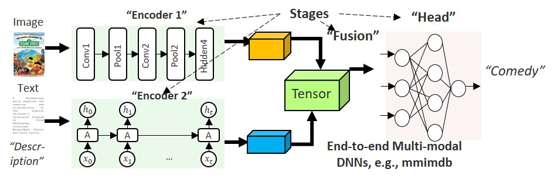

# MMBench: A Benchmark and Toolkit to Characterize and Analyze End-to-End Multi-modal DNN Workloads


## 1. Introduction

Multi-modal neural networks have become increasingly pervasive in many machine learning application domains due to their superior accuracy by fusing various modalities. However, they present many unique characteristics such as multi-stage execution, frequent synchronization and high heterogeneity, which are not well understood in the system and architecture community. This benchmark aim to help guide future software/hardware design and optimization for efficient inference of multi-modal DNN applications.

   
<div align="center">
   Figure 1: An example multi-modal application
</div>  
<br>
This Benchmark consists of mainly two parts: The multi-modal applications and the profile tool chain through which we generate the architectural characteristics. The workflow of MMBench is as easy as: 

1). Generate your own model or use the default model. 
2). Use our provided scripts to call profiling tools (mainly NVIDIA's). 
3). Use our utils to process the raw data and generate the result.

We use NVIDIA Nsight Systems v2021.5.2 and Nsight Compute v2022.1.1 to analyze the GPU execution pattern as well as CPU-GPU communication. Pytorch-profiler is also applied to help analyze higher level information. Versions other than this may lead to some problems. 

<br>
**More datasets and functions will be update soon.**


## 2. How to prepare the dataset

### MM-IMDB dataset
1. Download [raw mmimdb dataset](https://archive.org/download/mmimdb/mmimdb.tar.gz)(https://archive.org/download/mmimdb/mmimdb.tar.gz)
2. unzip the raw mmimdb dataset
3. Create the `list.txt` file: 
   ```bash
   ls ABSOLUTE_PATH_TO/mmimdb/dataset/*.json > list.txt
   ```
   Use the absolute path so that you can always find the raw data.

### AV-Mnist dataset
1. Download [raw avmnist dataset](https://drive.google.com/file/d/1KvKynJJca5tDtI5Mmp6CoRh9pQywH8Xp/view?usp=sharing)(https://drive.google.com/file/d/1KvKynJJca5tDtI5Mmp6CoRh9pQywH8Xp/view?usp=sharing)
2. Unzip the raw avmnist dataset
3. Modify the path in ./Multibench/multi_model_end2end_test.py: Locate the word `PATH_TO_AVMNIST` and change it to the path to `avmnist` folder, like `/home/xucheng/xh/data/Multimedia/avmnist`


### Medical_Vqa dataset
1. Download [raw medica_vqa dataset](https://zenodo.org/record/6784358). 
2. Place the zip file in any location and then unzip it and refer to the path to the unzipped folder as <path_data> in configs/medical_vqa/default_consistency.yaml. 
3. A more detailed description of the dataset can be found in the original repo(https://github.com/sergiotasconmorales/consistency_vqa).

### Medical_Segmentation dataset
1. Download the [raw medical_segmentation dataset](https://www.med.upenn.edu/sbia/brats2018/data.html) to ./MMBench/datastes/medical_segmentation/raw_data/
## 3. How to run the code
First, download .pth files (model weights, untrained) to ./models_save folder from [google drive](https://drive.google.com/drive/folders/19WYmZqRDEhls3gMfDepGhslTy-y-Afqc?usp=sharing)(https://drive.google.com/drive/folders/19WYmZqRDEhls3gMfDepGhslTy-y-Afqc?usp=sharing)

Second, run the script:
```bash
   cd Multibench
   python3 multi_model_end2end_test.py --model_name mmimdb_multi_interac_matrix
```
* --model_name: indicate the mdoel you want to run. supported: 

  avmnist: avmnist_simple_late_fusion, avmnist_tensor_matrix, avmnist_multi_interac_matrix, avmnist_cca

  mmimdb: mmimdb_simple_late_fusion, mmimdb_simple_early_fusion, mmimdb_low_rank_tensor, mmimdb_multi_interac_matrix

* --gpu: the gpu you want to use, only int type input is accepted, 0 default.

* --seed: the random seed, 20 default.


## 4. How to measure the performance in GPU
There are three main profile tools in this Benchmark:
1. Nsight compute. Nsight compute works in the following way:
```
ncu + parameters + execuable + parameters
```
Following is an example in MMBench/profile/avmnist.sh which measures 1) DRAM (DRAM utilization; 2) GPU OCP (achieved occupancy); 3) IPC; 4) GLD Eff (global
memory load) efficiency; 5) GST Eff (global memory store) efficiency of the multi-modal applciation. All the properties displayed in the paper can be measured using one of the sh commands. You can also create your own commands to explore the characteristics of multi-Modal DNNs.

```
sudo /usr/local/cuda-11.6/nsight-compute-2022.1.1/ncu --metrics smsp__sass_average_data_bytes_per_sector_mem_global_op_st.pct,smsp__inst_executed.avg.per_cycle_active,dram__throughput.avg.pct_of_peak_sustained_elapsed,smsp__sass_average_data_bytes_per_sector_mem_global_op_ld.pct,smsp__sass_average_data_bytes_per_sector_mem_global_op_st.pct /home/xucheng/.conda/envs/python3.7/bin/python3  /home/xucheng/MultiBench/examples/multimedia/avmnist_unimodal_0.py >avmnist-uni-radar.csv
```
Note that at this stage, we get the csv file as output. Nsight compute have to profile every individual kernel, which often achieves hunderds and thousands in our case. So we provide the jupyer program also stored in MMBench/profile/ folder. By changing tha parameters and locations, users shall be able to directly get the average performance of the application.


2. Nsight sys. For nsight sys, it works in a much easier way. Simply using:
```
nsys + execuable + parameters
```
can generate all the information needed. Since just some simple addition operations is needed, we do not provide a python file here. Information such as kernel time breakdown and memory transfer amount can be gained here. 


3.Pytorch profiler. For pytorch profiler, we do not directly write it in our program in current version. To leverage this tool, you should write corresponding code in the trainging and inference functions such as MMBench/models/training_structures/Supervised_Learning.py.


## 5. Support and contribute
If you have any suggestions about this project, you can post an issue or reach us by email.


## 6. Acknowledgement
Some codes and applications were adapted from the [MultiBench](https://github.com/pliang279/MultiBench).


## 7. Contributors

Correspondence to: 

  - [Cheng Xu](jerryxu@sjtu.edu.cn) (jerryxu@sjtu.edu.cn)
  - [Xuehan Tang](xuehantang00@gmail.com) (xuehantang00@gmail.com)
  - [Jiacheng Liu](liujiacheng@sjtu.edu.cn) (	liujiacheng@sjtu.edu.cn)
  - [Lingyu Sun](sunlingyu@sjtu.edu.cn) (sunlingyu@sjtu.edu.cn)
  - [Tongqiao Xu](tqxu19@fudan.edu.cn) (tqxu19@fudan.edu.cn)
  - [Peng Tang](85704592@qq.com) (85704592@qq.com)
  - [Xiaofeng Hou](	houxiaofeng@ust.hk) (houxiaofeng@ust.hk)


## 8. Related Publications

[**Characterizing and Understanding End-to-End
Multi-modal Neural Networks on GPUs**](https://ieeexplore.ieee.org/abstract/document/9924614)<br>
Xiaofeng Hou, Cheng Xu, Jiacheng Liu, Xuehan Tang, Lingyu Sun, Chao Li and Kwang-Ting Cheng<br>*IEEE Computer Architecture Letters (CAL)*

If you find this repository useful, please cite our paper:
```bibtex
@article{hou2022characterizing,
  title={Characterizing and Understanding End-to-End Multi-modal Neural Networks on GPUs},
  author={Xiaofeng Hou and Cheng Xu and Jiacheng Liu and Xuehan Tang and Lingyu Sun and Chao Li and Kwang-Ting Cheng},
  journal={IEEE Computer Architecture Letters (CAL)},
  year={2022}
}


```
