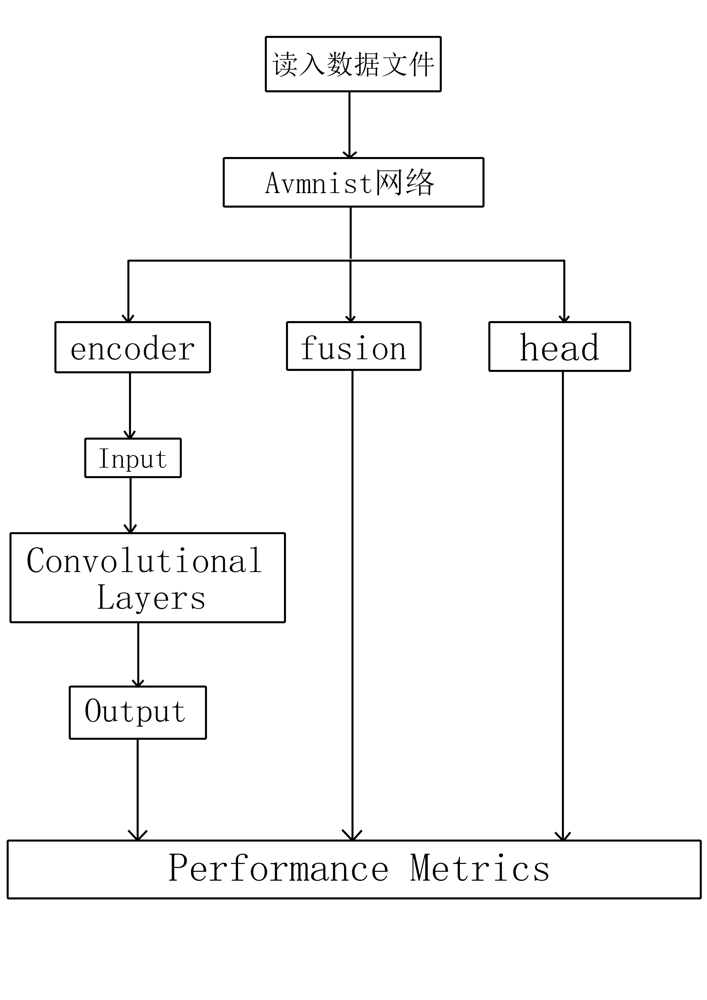

## 1.Introduction
This is a multimodal dataset that combines audio and visual information.
The structure of the model is :

## 2. How to prepare the dataset
1. Download [raw avmnist dataset](https://drive.google.com/file/d/1KvKynJJca5tDtI5Mmp6CoRh9pQywH8Xp/view?usp=sharing)(https://drive.google.com/file/d/1KvKynJJca5tDtI5Mmp6CoRh9pQywH8Xp/view?usp=sharing)
2. Unzip the raw avmnist dataset
3. Modify the path in ./inference.py: Locate the parameter in function  `get_dataloader` and change it to the path to `avmnist` folder, like `/home/xucheng/xh/data/Multimedia/avmnist`
## 3. How to run the code
```bash
   python inference.py --options encoder/fusion/head/normal
```
