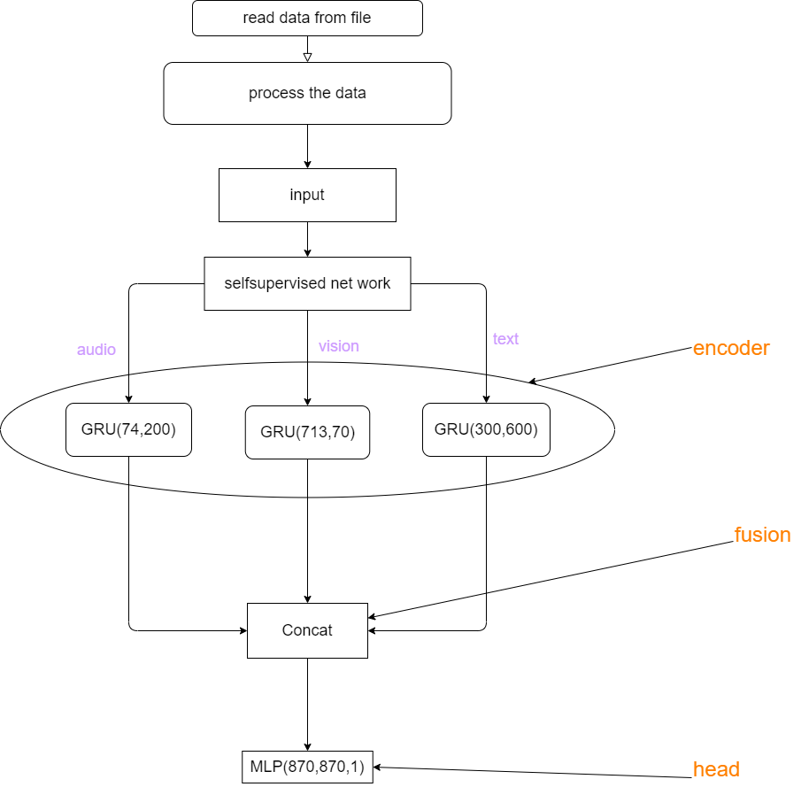

## Neural network architecture
<div align=center>

</div>

## How to download the dataset
If you want to run the entire network end-to-end, please refer to [CMU-MultimodalSDK](https://github.com/CMU-MultiComp-Lab/CMU-MultimodalSDK). You can run the `examples/mmdatasdk_examples/full_examples/process_mosei.py` code from that project, which is a code snippet for processing raw data and downloading the raw data.

Since processing the data with this code takes a significant amount of time, in our MMBench, we use a simpler approach to ensure the data format is correct.

## How to run this code
After downloading the dataset, place the files CMU_MOSEI_COVAREP.csd, CMU_MOSEI_Labels, CMU_MOSEI_TimestampedWordVectors, CMU_MOSEI_VisualOpenFace2 in the `datasets/affect/raw_data` folder of this project, and then you can run the code.

Example of running the code:
```bash
./scripts/ncu_metric.sh applications/CMU-MOSEI/affect_late_fusion.py applications/CMU-MOSEI/ncu_info_head.csv --options head
```

This is used to run the multi-modal network for the head section and measure hardware resource utilization.


<!-- ## Neural network architecture
<div align=center>

</div>


## 如何下载数据集
如果你希望端到端地运行整个网络，那么请参照[CMU-MultimodalSDK](https://github.com/CMU-MultiComp-Lab/CMU-MultimodalSDK)，你可以运行那个项目的 `examples/mmdatasdk_examples/full_examples/process_mosei.py` 代码，这是一段处理原始数据的代码，同时可以下载原始数据。

由于这段代码处理数据需要花费大量时间，因此在我们的MMBench中会利用更简单的方式处理数据，仅仅保证数据的格式正确。

## 如何运行这段代码
在下载了数据集之后，将文件CMU_MOSEI_COVAREP.csd,CMU_MOSEI_Labels,CMU_MOSEI_TimestampedWordVectors,CMU_MOSEI_VisualOpenFace2放入到本项目的文件夹 `datasets/affect/raw_data` 下，然后即可运行代码。

代码运行示例：
```bash
./scripts/ncu_metric.sh applications/CMU-MOSEI/affect_late_fusion.py applications/CMU-MOSEI/ncu_info_head.csv --options head
```

用于得到运行多模态网络的 `head` 部分并且测量硬件资源占用情况。 -->

