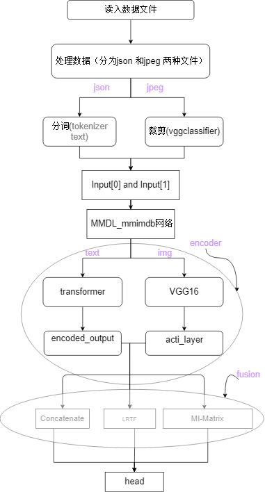

## 1.Introduction
This is a multimodal dataset about movies, which includes various modal information such as movie information, stills, movie dialogues, and emotional analysis.

The structure of the model is :



## 2. How to prepare the dataset
1. Download [raw mmimdb dataset](https://archive.org/download/mmimdb/mmimdb.tar.gz)(https://archive.org/download/mmimdb/mmimdb.tar.gz)
2. unzip the raw mmimdb dataset
3. Create the `list.txt` file: 
   ```bash
   find ABSOLUTE_PATH_TO/mmimdb/dataset -name "*.json" > list.txt
   ```
   Use the absolute path so that you can always find the raw data.
## 3. How to run the code
```bash
   python inference.py --model_name mmimdb_simple_late_fusion --options encoder/fusion/head/normal 
```
