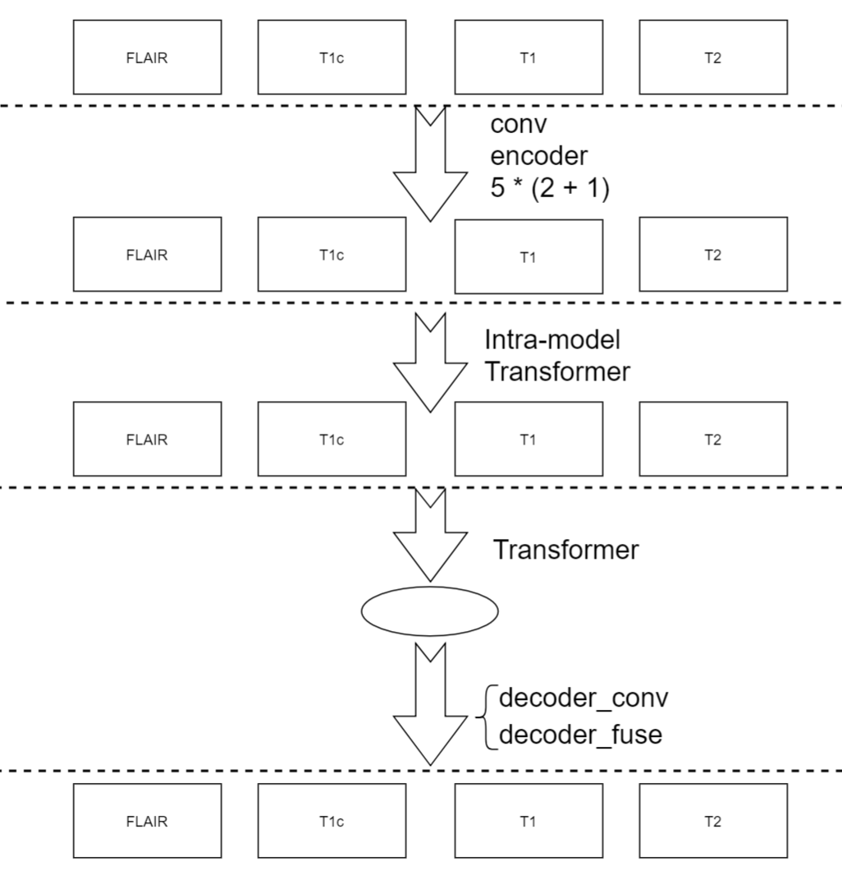

## 1.Introduction
This is a medical segmentation model. More information can be found in [origin repo](https://github.com/YaoZhang93/mmFormer).
The structure of the model is :



</img> 

## 2. How to prepare the dataset
1. Download the [raw medical_segmentation dataset](https://www.med.upenn.edu/sbia/brats2018/data.html)and set its path to "src_path =" in inference.py
## 3. How to run the code
run command:
```bash 
python inference.py --options normal/encoder/fusion/head
```
