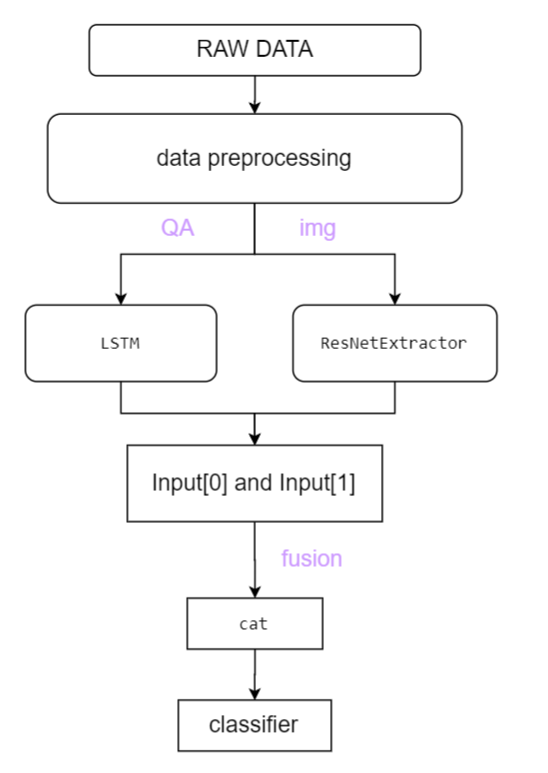

## 1.Introduction
This is a visual question answering model in medical imaging. More information can be found in [origin repo](https://github.com/sergiotasconmorales/consistency_vqa).
The structure of the model is :


</img>

## 2. How to prepare the dataset
1. Download [raw medica_vqa dataset](https://zenodo.org/record/6784358). 
2. Place the zip file in any location and then unzip it and refer to the path to the unzipped folder as <path_data> in configs/medical_vqa/default_consistency.yaml. 
3. A more detailed description of the dataset can be found in the original repo(https://github.com/sergiotasconmorales/consistency_vqa).
## 3. How to run the code
run command:
```bash 
python inference.py --config config/idrid_regions/single/default_consistency.yaml --options normal/encoder/fusion/head
```