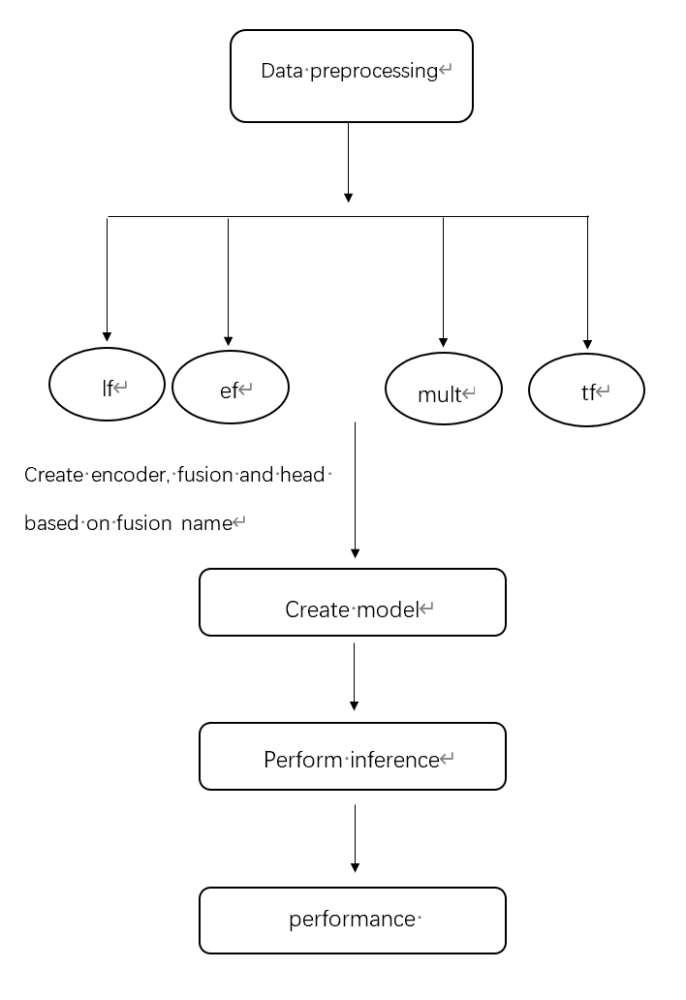

###### Ⅰ.Introduction

More information can be found in [original repo](https://github.com/brentyi/multimodalfilter). The structure of the model is:




###### Ⅱ .How to prepare the dataset

- Download raw dataset [gentle_push_10.hdf5](https://drive.google.com/file/d/1qmBCfsAGu8eew-CQFmV1svodl9VJa6fX/view) , [gentle_push_300.hdf5](https://drive.google.com/file/d/18dr1z0N__yFiP_DAKxy-Hs9Vy_AsaW6Q/view) , [gentle_push_1000.hdf5](https://drive.google.com/file/d/1JTgmq1KPRK9HYi8BgvljKg5MPqT_N4cR/view) 

- Modify the path in datasets/gentle_push/dataloader.py : Locate the path in 
  `return _load_trajectories("/home/xucheng/xh/data/MuJoCo_Push/gentle_push_1000.hdf5", **dataset_args)`

  and change it to the path to dataset file you have downloaded.

A more detailed description of the dataset can be found in the [original repo](https://github.com/brentyi/multimodalfilter).

###### Ⅲ.How to Run the Code

run command:

```bash
python inference.py --options normal/encoder/fusion/head
```