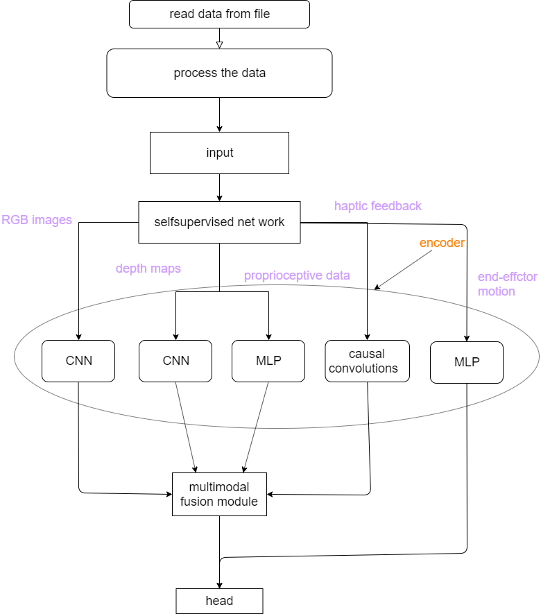

## Neural network architecture
<div align=center>

</div>

## How to download the dataset
Go to the folder `datasets/robotics` and run the script `download_data.sh`. For more information about this dataset, please refer to the original [repository](https://github.com/stanford-iprl-lab/multimodal_representation).

## How to run this code
This project aims to assist users in easily obtaining hardware data when running multimodal neural networks. You can run the following command:

```bash 
./scripts/ncu_metric.sh applications/Vision-Touch/LRTF.py applications/Vision-Touch/ncu_info_encoder.csv --options encoder
```

This command will provide information about hardware resource utilization. The optional parameter `--option` can be set to normal, encoder, fusion, or head (default is normal), enabling staged measurement. The results will be saved in the file `applications/Vision-Touch/ncu_info.csv`, and the average value will be displayed in the terminal.


<!-- ## 神经网络结构

## 如何下载数据集
进入文件夹 `datasets/robotics`，运行脚本 `download_data.sh`。关于该数据集的更多信息，可以参见原始[仓库](https://github.com/stanford-iprl-lab/multimodal_representation)

## 如何运行这段代码
本项目是为了帮助用户更方便的得到运行多模态神经网络时得到硬件数据，因此可以运行
```bash
./scripts/ncu_metric.sh applications/Vision-Touch/LRTF.py applications/Vision-Touch/ncu_info_encoder.csv --options encoder
```

得到硬件资源利用率情况。其中可选参数 `--option` 有(normal/encoder/fusion/head，默认为normal)，能够实现分阶段测量。最终得到的结果会输入到文件 `applications/Vision-Touch/ncu_info.csv` 中，而平均值会在终端输出。 -->